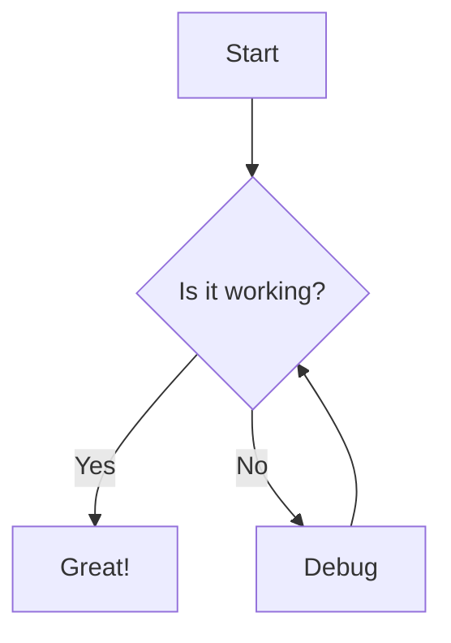

# Markdown to PDF Converter

A tool for converting Markdown documents to PDF with accessibility features, particularly using the OpenDyslexic font to improve readability for people with dyslexia. The tool also provides excellent support for Mermaid diagrams with precise positioning in the final document.

## Project Structure

```
.
├── docker-compose.yml        # Docker configuration for the conversion process
├── md2pdf.sh                # Conversion script
├── mermaid-preprocessor.sh  # Script for preprocessing Mermaid diagrams
├── template.tex             # LaTeX template with OpenDyslexic font configuration
├── style.css                # CSS styling for HTML output (if needed)
├── mermaid-diagrams/        # Directory for generated diagram images
├── mermaid-temp/           # Temporary directory for Mermaid processing
├── fonts/                   # Directory containing font files
│   └── OpenDyslexic/        # OpenDyslexic font directory
│       ├── OpenDyslexic-Regular.otf
│       ├── OpenDyslexic-Bold.otf
│       ├── OpenDyslexic-Italic.otf
│       └── OpenDyslexic-Bold-Italic.otf
```

## Requirements

- Docker and Docker Compose
- Bash shell
- Docker image `minlag/mermaid-cli` (pulled automatically when needed)

## Usage

To convert a Markdown file to PDF:

```bash
./md2pdf.sh input.md [output.pdf]
```

### Parameters:

- `input.md`: The Markdown file you want to convert (required)
- `output.pdf`: The name of the output PDF file (optional - defaults to the same name as the input file with .pdf extension)

### Examples:

```bash
# Convert summary.md to summary.pdf
./md2pdf.sh summary.md

# Convert summary.md to custom-output.pdf
./md2pdf.sh summary.md custom-output.pdf
```

## Mermaid Diagram Support

This tool provides excellent support for Mermaid diagrams. Simply include your diagrams in the Markdown file using the standard Mermaid syntax:

````markdown

````

The diagrams will be:
- Automatically converted to PNG images
- Positioned exactly where they appear in the original document
- Properly sized to fit the page width
- Rendered with high quality

## About OpenDyslexic

[OpenDyslexic](https://opendyslexic.org/) is a free, open-source font designed to increase readability for readers with dyslexia. Key features include:

- **Weighted Bottoms**: Letters have heavier weighted bottoms to help prevent them from flipping and swapping
- **Unique Shapes**: Each letter has a unique shape, helping to prevent confusion between similar-looking letters
- **Increased Letter Spacing**: More space between letters to reduce crowding effects
- **High Readability**: Designed specifically to enhance readability and comprehension

This font is particularly helpful for people with dyslexia, but can also improve reading comfort for anyone experiencing visual fatigue from extended reading.

For more information, visit the [OpenDyslexic website](https://opendyslexic.org/) or their [GitHub repository](https://github.com/antijingoist/opendyslexic).

## Features

- Uses the [OpenDyslexic](https://opendyslexic.org/) font family for improved readability
- Converts Markdown to PDF using Pandoc via Docker
- Supports Mermaid diagrams through automatic preprocessing
- Ensures precise positioning of diagrams in the document
- Automatically resizes diagrams to fit page width
- Customizable LaTeX template for PDF generation
- Preserves formatting, links, and images from the Markdown source
- Supports code blocks and syntax highlighting
- Handles tables and other complex Markdown elements

## How It Works

1. The script takes your Markdown file as input
2. It preprocesses the file to convert Mermaid diagrams to PNG images using the `mermaid-preprocessor.sh` script:
   - Each Mermaid code block is extracted and processed individually
   - The Mermaid CLI Docker container converts each diagram to a PNG image
   - The original Mermaid code blocks are replaced with LaTeX code that ensures precise positioning
3. The processed Markdown file is saved with a "-processed.md" suffix
4. The docker-compose.yml file is updated with your specified input and output filenames
5. Docker Compose runs the pandoc image with `--force-recreate` to avoid container conflicts
6. After conversion, containers are automatically cleaned up with `docker compose down`
7. The conversion uses XeLaTeX as the PDF engine for proper font rendering
8. The template.tex file provides the LaTeX configuration with OpenDyslexic font
9. The final PDF is generated with improved readability for people with dyslexia

## Customization

### Modifying the LaTeX Template

You can customize the appearance of the generated PDF by modifying the `template.tex` file. This file contains the LaTeX preamble and document structure used by Pandoc.

### Adjusting Diagram Size and Style

To change the size or style of the generated Mermaid diagrams, modify the Docker run command in the `mermaid-preprocessor.sh` script. The current settings generate diagrams with:
- Width: 800px
- Height: 600px (auto-adjusted to maintain aspect ratio)
- Transparent background

## Troubleshooting

If you encounter any issues:

- Make sure Docker and Docker Compose are installed and running
- Verify that the fonts directory contains all required OpenDyslexic font files
- Check that your Markdown file exists and is properly formatted
- For complex Markdown with special elements, you may need to adjust the template.tex file
- If diagrams are not appearing correctly, check the mermaid-diagrams directory for the generated PNG files
- Examine the "-processed.md" file to see how the Mermaid diagrams were converted

## License

This tool is provided as open source software. Feel free to modify and distribute according to your needs.
